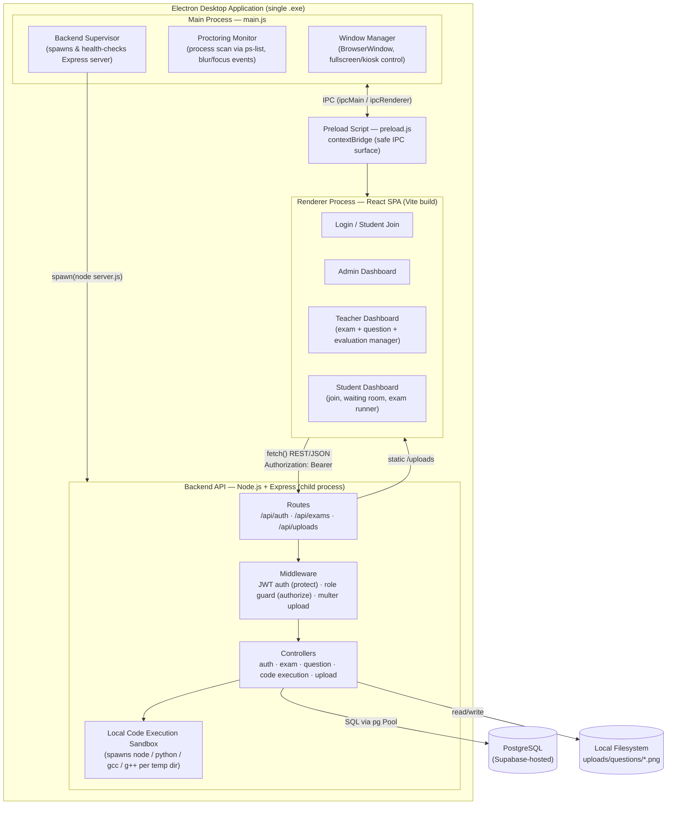
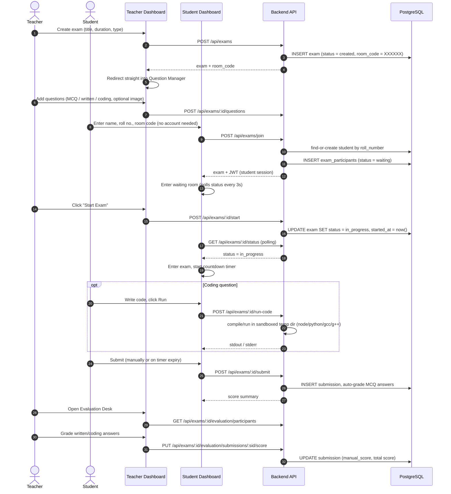

# Invigilo — Secure Exam Desktop Application

A secure desktop application for conducting proctored online examinations, built with **Electron**, **React**, **Express**, and **PostgreSQL**. Invigilo supports multiple-choice, written, and auto-graded coding questions, a passwordless room-code join flow for students, and real-time exam lifecycle management for teachers.

This document describes the system architecture, the architectural and design patterns applied, and instructions to build and run the project — written to accompany the project's academic/journal submission.

---

## Table of Contents

- [Overview](#overview)
- [System Architecture](#system-architecture)
- [Architectural & Design Patterns](#architectural--design-patterns)
- [Exam Lifecycle (Sequence Diagram)](#exam-lifecycle-sequence-diagram)
- [Features](#features)
- [Tech Stack](#tech-stack)
- [Project Structure](#project-structure)
- [Screenshots](#screenshots)
- [Getting Started](#getting-started)
- [Building a Distributable (.exe)](#building-a-distributable-exe)
- [API Reference](#api-reference)
- [Database Schema](#database-schema)
- [Security Notes](#security-notes)
- [Roadmap](#roadmap)
- [License](#license)

---

## Overview

Invigilo is packaged as a single Electron desktop application with an embedded backend process, so invigilators and students only ever run one executable. Internally it is composed of three cooperating layers:

1. **Desktop shell (Electron main process)** — owns the OS-level window, spawns and supervises the backend API as a child process, and performs local proctoring (forbidden-process detection, window-focus/blur monitoring, forced full-screen during an active exam).
2. **Presentation layer (React renderer, built with Vite)** — role-specific single-page dashboards for Admin, Teacher, and Student, talking to the backend exclusively over a local HTTP REST API.
3. **Application/data layer (Express + PostgreSQL)** — stateless, JWT-authenticated REST API implementing exam, question, submission, and code-execution logic, backed by a PostgreSQL database (Supabase-hosted).

---

## System Architecture



**Process boundaries matter here.** The renderer never talks to PostgreSQL or the filesystem directly — it only ever calls the local REST API. The main process never touches application/business logic — it only manages the window, OS-level proctoring signals, and the backend's lifecycle. This separation is what keeps the desktop shell replaceable (the same backend could serve a browser client) and the backend testable independently of Electron.

---

## Architectural & Design Patterns

The system is best described as a **three-tier client–server architecture**, delivered through **Electron's multi-process model**, with a handful of well-known design patterns applied at the component level. This combination was chosen deliberately over alternatives (e.g., a monolithic Electron renderer talking directly to the database, or a purely offline app) for the reasons below.

| Layer | Pattern | Why it fits |
|---|---|---|
| Overall system | **Three-tier client–server architecture** (Presentation → Application → Data) | The React UI, Express API, and PostgreSQL database are independently deployable and testable. The same backend can serve any client (desktop, browser, future mobile) without modification. |
| Electron shell | **Multi-process architecture with a Bridge (contextBridge)** | Electron's main/renderer separation is itself a textbook process-isolation pattern; `preload.js` acts as a **Bridge**, exposing only a whitelisted, IPC-based API surface to the untrusted renderer instead of full Node.js access — reducing the desktop app's attack surface. |
| Backend request handling | **Layered (N-tier) / MVC-inspired pipeline**: `routes → middleware → controllers → data access (pg Pool)` | Each layer has one responsibility (routing, cross-cutting auth/upload concerns, business logic, persistence), which keeps controllers thin and testable and lets `middleware/auth.js` be reused across every protected route. |
| Request authorization | **Chain of Responsibility** (`protect` → `authorize(role)` Express middleware chain) | Each request passes through a sequence of independent handlers, any of which can short-circuit the chain (401/403) before it reaches the controller. |
| Cross-cutting session handling | **Interceptor pattern** (`api.js`'s `apiRequest`/`apiUpload` + registered `unauthorizedHandler`) | Every network call is funneled through one interceptor that centrally detects an expired/invalid session (HTTP 401) and triggers a single, consistent logout — instead of scattering that check across every screen. |
| Frontend state/UI | **Component-based architecture** (React) with a **Provider pattern** (`ModalProvider` / React Context) for cross-cutting UI concerns (confirm/alert dialogs) | Keeps dashboards declarative and avoids prop-drilling modal state through every feature component. |
| Proctoring | **Observer pattern** (Electron main process observes OS-level signals — window blur, forbidden processes — and emits IPC events the renderer subscribes to) | Decouples *detection* (main process, privileged) from *reaction* (renderer, e.g. showing a warning or auto-submitting), which is also a security boundary: the renderer cannot be tricked into suppressing a violation it never controls. |
| Code execution | **Strategy pattern** (`normalizeLanguage` + per-language compile/run branch in `codeExecutionController.js`) | Each supported language (JavaScript, Python, C, C++) is an interchangeable execution strategy behind one `runProgram()` entry point, making it straightforward to add a new language without touching call sites. |

**Why this combination, and not an alternative:**
- A **monolithic renderer-to-database** design was rejected because it would require embedding database credentials in a distributable desktop binary — a critical security liability — and would prevent the same backend from ever serving a second client.
- A **microservices** split was rejected as premature: exam management, evaluation, and code execution are cohesive concerns with shared authorization and data-consistency needs (e.g., a submission's score depends on both auto-graded and manually-graded questions in the same transaction); splitting them would add distributed-transaction complexity without a corresponding scalability need for a single-institution exam tool.
- The **three-tier + layered backend** combination gives the clearest mapping from an academic software-engineering standpoint: it is straightforward to reason about, test layer-by-layer, and document — all of which matter for a system intended to accompany a written report.

---

## Exam Lifecycle (Sequence Diagram)



---

## Features

### Authentication & Access Control
- Stateless JWT authentication with a 24-hour token expiry
- Role-based access control: **Admin**, **Teacher**, **Student**
- **Passwordless student access** — students join with just their name, roll number, and the room code; an account is auto-provisioned on first join, no registration flow required
- **Admin-issued teacher onboarding** — an admin creates teacher accounts with a temporary password; teachers are forced to set a new password on first login (`must_change_password` flag)
- Centralized session-expiry handling — any `401` response automatically logs the user out with a clear "session expired" prompt, instead of leaving a dead session on screen

### Exam Management (Teacher)
- Create **Lab Quiz** (MCQ/written) or **Lab Test** (coding) exams; saving a new exam jumps straight into the question editor
- Auto-generated unique 6-character room codes
- Question bank supporting MCQ, written (manually graded), and coding questions
- Optional image attached to any question (rendered above the question text for both teacher preview and student view)
- Live participant list with 3-second polling while students join
- One-click "Start Exam" that begins the countdown for every joined student simultaneously
- Evaluation desk for manually grading written/coding answers, combined with auto-graded MCQ scores into a final score

### Student Experience
- Join screen: **Name + Roll No. + Room Code** — no login screen, no password
- Waiting room with live participant count until the teacher starts the exam
- Live countdown timer with automatic submission at time-out
- In-browser code editor (Monaco) for coding questions with **offline** Run support for **JavaScript, Python, C, and C++**
- Automatic re-submission on forbidden-application detection or repeated focus-loss violations

### Proctoring (Electron main process)
- Forced full-screen / always-on-top window during an active exam
- Forbidden-process detection (e.g., screen recorders, remote-desktop tools) via periodic process scanning
- Window blur/focus-loss violation tracking with configurable severity and an auto-submit threshold

### File Uploads
- Teacher-only question image upload (PNG/JPEG/WEBP/GIF, 5 MB limit) served from a whitelisted `/uploads/questions/` path — upload payloads are validated so a request cannot smuggle in an arbitrary external URL

---

## Tech Stack

### Desktop Shell
- **Electron** — cross-platform desktop runtime (main + renderer processes)
- **electron-builder** — packaging into a Windows installer/executable

### Frontend (Renderer)
- **React 19** — component-based SPA
- **Vite** — build tooling and dev server
- **Monaco Editor** — in-app code editor for coding questions
- Plain CSS (theme-aware, no framework dependency)

### Backend
- **Node.js + Express** — REST API
- **PostgreSQL** (Supabase-hosted) via the `pg` driver — no ORM, parameterized SQL
- **JWT (jsonwebtoken)** — stateless authentication
- **bcrypt** — password hashing
- **multer** — multipart image upload handling
- Local **gcc / g++ / node / python** invocations for sandboxed, offline code execution (no external judge/API dependency)

---

## Project Structure

```
secure-exam-desktop-app/
├── main.js                       # Electron main process: window, proctoring, backend supervisor
├── preload.js                    # contextBridge — safe IPC surface exposed to the renderer
├── package.json                  # Electron app + electron-builder config
│
├── backend/                      # Express REST API (spawned as a child process)
│   ├── server.js                 # App entry point
│   ├── config/database.js        # PostgreSQL connection pool
│   ├── models/schema.js          # Idempotent schema creation + additive migrations
│   ├── middleware/
│   │   ├── auth.js               # protect / authorize (JWT + role guard)
│   │   └── upload.js             # multer disk storage for question images
│   ├── controllers/
│   │   ├── authController.js     # login, admin-only register, change-password
│   │   ├── examController.js     # exam CRUD, room-code join, start, status
│   │   ├── questionController.js # question CRUD, submissions, evaluation
│   │   ├── codeExecutionController.js  # sandboxed JS/Python/C/C++ execution
│   │   └── uploadController.js   # question image upload endpoint
│   └── routes/                   # auth.js · exams.js · uploads.js
│
├── renderer/                     # React SPA (built with Vite)
│   ├── index.html
│   └── src/
│       ├── App.jsx                # Top-level routing/session state
│       ├── api.js                 # fetch wrapper + session-expiry interceptor
│       ├── pages/                 # LoginPage, ChangePasswordPage
│       └── features/
│           ├── admin/AdminDashboard.jsx
│           ├── teacher/TeacherDashboard.jsx
│           └── student/StudentDashboard.jsx
│
└── docs/
    └── screenshots/               # Application screenshots (see below)
```

---

## Screenshots

> _Screenshots to be added here — run the app locally (see [Getting Started](#getting-started)) and place images under `docs/screenshots/`._

| Screen | Preview |
|---|---|
| Login / role selection | `docs/screenshots/login.png` |
| Student join (room code) | `docs/screenshots/student-join.png` |
| Teacher dashboard | `docs/screenshots/teacher-dashboard.png` |
| Question editor | `docs/screenshots/question-editor.png` |
| Student exam view | `docs/screenshots/student-exam.png` |
| Evaluation desk | `docs/screenshots/evaluation-desk.png` |

---

## Getting Started

### Prerequisites
- Node.js v18+ and npm
- A PostgreSQL database (local install or a [Supabase](https://supabase.com) project)
- `gcc`/`g++` on `PATH` if you want offline C/C++ code execution to work (e.g. via MinGW-w64 on Windows)

### 1. Clone and install
```bash
git clone https://github.com/Nafiz001/secure-exam-desktop-app.git
cd secure-exam-desktop-app
npm install
npm run install:backend
```

### 2. Configure the backend
Create `backend/.env` (see `backend/.env.example`):
```env
PORT=5000
NODE_ENV=development

DB_HOST=your-db-host
DB_PORT=5432
DB_NAME=your-db-name
DB_USER=your-db-user
DB_PASSWORD=your-db-password

JWT_SECRET=change-this-secret
JWT_EXPIRES_IN=24h
```
The schema (tables, columns, indexes) is created automatically on first backend start — no manual migration step is required.

### 3. Seed an initial admin account
```bash
cd backend
node create-users.js
cd ..
```

### 4. Run the app
```bash
npm start
```
This builds the renderer and launches the Electron app, which in turn spawns the backend automatically. For frontend-only iteration, `npm run dev:renderer` starts the Vite dev server independently.

---

## Building a Distributable (.exe)

```bash
npm run pack:win
```

This runs `vite build`, installs production-only backend dependencies, and invokes `electron-builder` with the `win`/`nsis` target. The output installer is written to `dist/` at the project root (e.g. `dist/Secure Exam Desktop Setup <version>.exe`). The packaged app bundles the backend under `resources/backend` and connects to whatever PostgreSQL instance is configured via its own `backend/.env` at build time.

---

## API Reference

Base URL: `http://localhost:5000/api`

### Auth (`/api/auth`)
| Method | Endpoint | Access | Description |
|---|---|---|---|
| POST | `/login` | Public | Email + password login (Teacher/Admin) |
| POST | `/register` | Admin | Create a Teacher/Admin account with an initial password |
| POST | `/change-password` | Authenticated | Change own password (clears `must_change_password`) |
| GET | `/me` | Authenticated | Get current user profile |

### Exams (`/api/exams`)
| Method | Endpoint | Access | Description |
|---|---|---|---|
| POST | `/` | Teacher | Create exam (auto-generates room code) |
| GET | `/` | Authenticated | List exams (role-scoped) |
| GET | `/my-active` | Student | List the student's joined/active exams |
| GET | `/:id` | Authenticated | Get exam details (+ questions) |
| PUT | `/:id` | Teacher | Update exam |
| DELETE | `/:id` | Teacher | Delete exam |
| POST | `/join` | **Public** | Join by room code + name + roll number (no prior login) |
| GET | `/:id/participants` | Teacher | List joined participants |
| POST | `/:id/start` | Teacher | Start the exam for all participants |
| GET | `/:id/status` | Authenticated | Poll exam status |
| POST | `/:examId/questions` | Teacher | Add a question |
| PUT | `/questions/:id` | Teacher | Update a question |
| DELETE | `/questions/:id` | Teacher | Delete a question |
| POST | `/:id/submit` | Student | Submit exam answers |
| POST | `/:id/run-code` | Student | Run code for a coding question (sandboxed) |
| GET | `/:examId/submissions` | Teacher | List submissions |
| GET | `/:examId/evaluation/participants` | Teacher | Evaluation participant list |
| GET | `/:examId/evaluation/submissions/:sid` | Teacher | Get one student's answer sheet |
| PUT | `/:examId/evaluation/submissions/:sid/score` | Teacher | Save manual grading |

### Uploads (`/api/uploads`)
| Method | Endpoint | Access | Description |
|---|---|---|---|
| POST | `/question-image` | Teacher | Upload a question image (multipart) |

---

## Database Schema

```sql
-- Users: students, teachers, and admins in one table, disambiguated by role
CREATE TABLE users (
  id SERIAL PRIMARY KEY,
  name VARCHAR(255) NOT NULL,
  email VARCHAR(255) UNIQUE NOT NULL,
  password_hash VARCHAR(255) NOT NULL,
  roll_number VARCHAR(50),
  role VARCHAR(20) NOT NULL CHECK (role IN ('student', 'teacher', 'admin')),
  must_change_password BOOLEAN NOT NULL DEFAULT FALSE,
  created_at TIMESTAMP DEFAULT CURRENT_TIMESTAMP,
  updated_at TIMESTAMP DEFAULT CURRENT_TIMESTAMP
);

-- Exams: room-code-based lifecycle (created -> waiting -> in_progress -> completed)
CREATE TABLE exams (
  id SERIAL PRIMARY KEY,
  title VARCHAR(255) NOT NULL,
  description TEXT,
  exam_type VARCHAR(20) NOT NULL DEFAULT 'lab_quiz', -- lab_quiz | lab_test
  duration INTEGER NOT NULL,
  created_by INTEGER REFERENCES users(id) ON DELETE CASCADE,
  room_code VARCHAR(6) UNIQUE,
  status VARCHAR(20) DEFAULT 'created',
  started_at TIMESTAMP NULL,
  created_at TIMESTAMP DEFAULT CURRENT_TIMESTAMP,
  updated_at TIMESTAMP DEFAULT CURRENT_TIMESTAMP
);

-- Questions: supports MCQ, written, and coding question types
CREATE TABLE questions (
  id SERIAL PRIMARY KEY,
  exam_id INTEGER REFERENCES exams(id) ON DELETE CASCADE,
  question_text TEXT NOT NULL,
  question_type VARCHAR(20) NOT NULL DEFAULT 'mcq', -- mcq | written | coding
  options JSONB,             -- MCQ choices
  correct_answer VARCHAR(20),
  reference_answer TEXT,     -- written-question grading reference
  sample_input TEXT,
  sample_output TEXT,
  starter_code TEXT,
  image_url TEXT,            -- optional question image
  marks INTEGER DEFAULT 1,
  created_at TIMESTAMP DEFAULT CURRENT_TIMESTAMP
);

-- Submissions: one row per student per exam, auto- and manually-graded scores combined
CREATE TABLE submissions (
  id SERIAL PRIMARY KEY,
  exam_id INTEGER REFERENCES exams(id) ON DELETE CASCADE,
  student_id INTEGER REFERENCES users(id) ON DELETE CASCADE,
  answers JSONB NOT NULL,
  violations JSONB DEFAULT '[]',
  submitted_at TIMESTAMP DEFAULT CURRENT_TIMESTAMP,
  auto_score INTEGER DEFAULT 0,
  manual_score INTEGER DEFAULT 0,
  score INTEGER DEFAULT 0,
  evaluation_status VARCHAR(20) DEFAULT 'pending',
  evaluated_at TIMESTAMP NULL,
  evaluated_by INTEGER REFERENCES users(id) ON DELETE SET NULL,
  UNIQUE(exam_id, student_id)
);

-- Exam participants: room-code join records + waiting-room presence
CREATE TABLE exam_participants (
  id SERIAL PRIMARY KEY,
  exam_id INTEGER REFERENCES exams(id) ON DELETE CASCADE,
  student_id INTEGER REFERENCES users(id) ON DELETE CASCADE,
  student_name VARCHAR(255),
  joined_at TIMESTAMP DEFAULT CURRENT_TIMESTAMP,
  status VARCHAR(20) DEFAULT 'waiting',
  UNIQUE(exam_id, student_id)
);
```

---

## Security Notes

- Passwords are hashed with bcrypt; JWTs are signed with a server-side secret and expire after 24 hours.
- Every protected route runs through a `protect` (token verification) → `authorize(role)` (role check) middleware chain — see [Architectural & Design Patterns](#architectural--design-patterns).
- Uploaded question images are validated by MIME type and file size at upload time, and the stored `image_url` is re-validated against a whitelisted path pattern on every question create/update, preventing arbitrary URL injection into question payloads.
- The Electron renderer has no direct Node.js/filesystem access — only the whitelisted API exposed by `preload.js` via `contextBridge`, limiting the impact of a compromised or malicious renderer context.
- Code submitted to the "Run" endpoint executes locally in a per-request temporary directory with a bounded timeout — acceptable for a trusted classroom setting, but **not** a hardened multi-tenant sandbox; do not expose this endpoint to untrusted networks.

---

## Roadmap

- [ ] Admin analytics dashboard (exam/participation reporting)
- [ ] Bulk student roster import (CSV)
- [ ] Video/screen recording during exams
- [ ] Stronger code-execution isolation (containerized sandbox)

---

## License

This project is proprietary and confidential, developed as an academic project.

---

## Author

**Md. Nafiz Ahmed**
